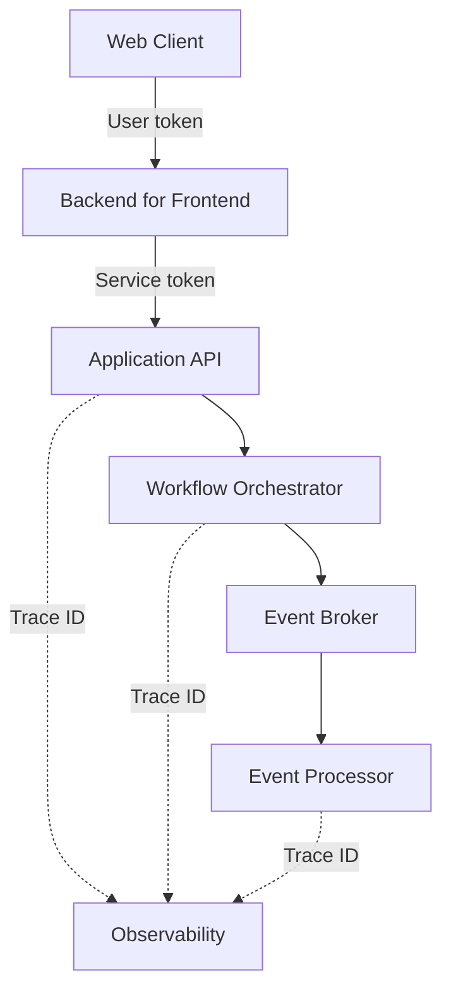

# Backend Request Flow Lab

An interactive, recruiter-friendly visualization of how a request travels through a modern distributed backend—from a web client and backend-for-frontend (BFF) through APIs, orchestration, event streaming, background processing, and observability.

This project turns an architecture diagram into a hands-on debugging tool. Users can run healthy and failing requests, inspect each component, follow a trace ID across service boundaries, compare user and service authentication, and work through symptom-based troubleshooting paths.

> This is a generalized educational project. All service names, trace IDs, application IDs, and scenarios are fictitious and contain no proprietary code, credentials, or production data.

## Highlights

- Clickable architecture components with ownership and diagnostic details
- Animated request tracing with Run, Step, and Reset controls
- Five scenarios: healthy request, invalid user token, rejected service token, unavailable event broker, and missing downstream result
- Clear comparison of user-token and service-token boundaries
- Troubleshooting workbench with interactive checklists and evidence paths
- Responsive, accessible interface with reduced-motion support

## Architecture



The synchronous request path handles the immediate API response. The event path handles asynchronous work, while one correlation ID connects logs across both paths.

## Tech stack

- React 19
- Vite 7
- Modern CSS with responsive layouts and accessible interactions
- Cloudflare-compatible server entrypoint for private Sites hosting

## Run locally

```bash
npm install
npm run dev
```

Open the local URL printed by Vite.

For a production build:

```bash
npm run build
```

## What this project demonstrates

- Translating distributed-system behavior into an understandable UI
- Modeling synchronous and asynchronous request paths
- Authentication-boundary reasoning
- Trace-based debugging and observability concepts
- State-driven React interactions
- Responsive front-end implementation and deployment adaptation

## Project structure

```text
app/
  page.jsx       Interactive application and scenario model
  globals.css    Responsive visual system
src/
  main.jsx       React entrypoint
server/
  index.js       Hosting runtime adapter
index.html       Vite document shell
vite.config.js   Production build configuration
```

## Future improvements

- Import OpenTelemetry JSON traces
- Add latency and error-rate charts
- Save custom architecture diagrams
- Export a troubleshooting report
- Add component and end-to-end tests

## License

MIT
