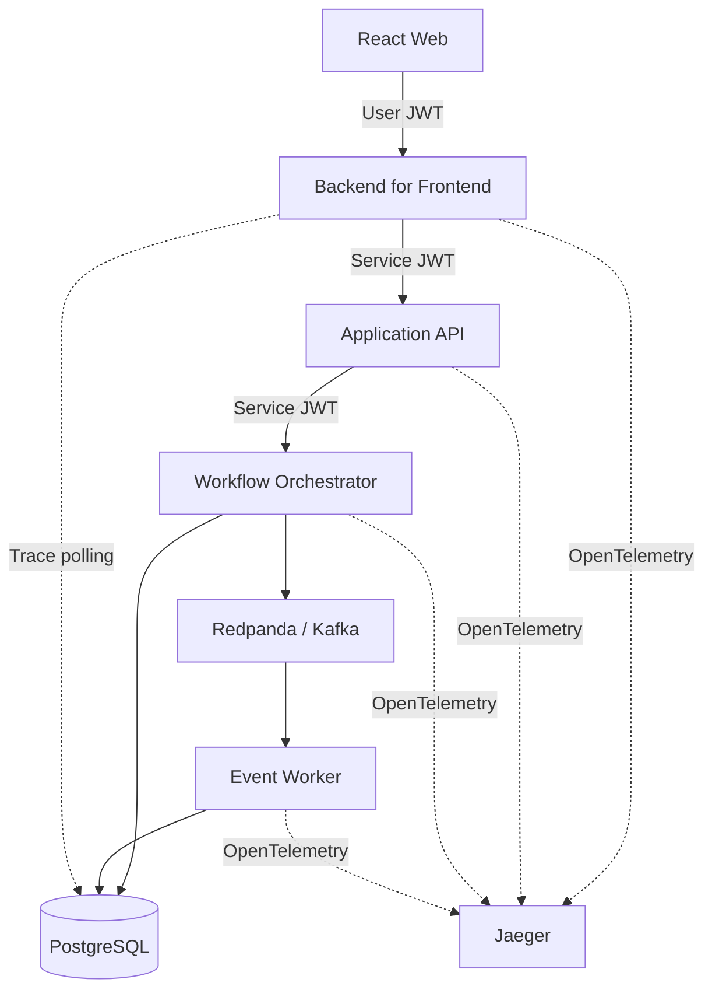

# Backend Request Flow Lab

**[Open the live interactive demo](https://backend-request-flow-lab.chakradharnemali.chatgpt.site)** · **[View CI runs](https://github.com/Chakradhar6304/backend-request-flow-lab/actions)**

A working TypeScript distributed-systems lab that makes an end-to-end backend request visible. It combines an interactive React trace UI with independently runnable services, JWT authentication boundaries, PostgreSQL state, Kafka-compatible event processing, OpenTelemetry spans, deterministic failure injection, automated tests, and CI.

> All names, identifiers, payloads, and failure scenarios are fictitious. The repository contains no proprietary code, credentials, or production data.

## What this project demonstrates

Backend requests are difficult to debug when they cross several services and then continue asynchronously. This project turns that invisible flow into a trace that can be explored step by step.

In the public demo, a visitor can:

- Run a healthy request from the web client through the BFF, API, orchestrator, Kafka, and worker
- Click each component to understand its responsibility
- Follow a trace ID across service boundaries
- Compare user JWT and service JWT authentication
- Inject token, Kafka, and missing-result failures and see exactly where they stop the flow
- Use symptom-based troubleshooting guidance to identify the likely failing service

The project demonstrates practical knowledge of API design, microservice boundaries, asynchronous event processing, authentication, observability, failure handling, automated testing, and containerized development.

## Demo and backend verification

| Environment | What runs |
|---|---|
| [Public demo](https://backend-request-flow-lab.chakradharnemali.chatgpt.site) | The React experience runs in interactive simulation mode so anyone can explore it for free without permanent cloud infrastructure. |
| Local Docker Compose | The real BFF, Application API, orchestrator, worker, PostgreSQL, Redpanda/Kafka, and Jaeger stack runs end to end. |
| GitHub Actions | The complete containerized stack is built and smoke-tested automatically on every change. |

The public UI does not pretend to be connected to always-on backend services. It labels simulation mode clearly; the real integration is reproducible locally and verified in CI.

## What happens when a request runs



1. The React client obtains a short-lived demo user JWT and calls the BFF.
2. The BFF validates the user audience and calls the Application API with a service JWT.
3. The API validates its service audience and calls the workflow orchestrator with another service JWT.
4. The orchestrator persists workflow state and trace events in PostgreSQL.
5. A versioned `application.created.v1` event is published to Redpanda using the Kafka protocol.
6. The worker consumes the event, performs asynchronous work, and marks the trace complete.
7. The UI polls the trace endpoint and animates the real persisted events. If services are offline, it clearly switches to simulation mode.

## Engineering features

- Four independently runnable Node.js/TypeScript services
- User-token and service-token JWT audience enforcement
- Versioned Kafka topic and consumer group
- PostgreSQL application state and trace-event persistence
- Structured Fastify/Pino logs and propagated `x-trace-id`
- OpenTelemetry export to Jaeger
- Healthy, invalid-user-token, invalid-service-token, Kafka-failure, and missing-result scenarios
- React UI with live-backend detection and a simulation fallback
- Unit tests for auth and event contracts
- Docker Compose environment and an end-to-end smoke test
- GitHub Actions verification and integration jobs

## Stack

React 19 · Vite 7 · TypeScript · Node.js 22 · Fastify · PostgreSQL · KafkaJS · Redpanda · OpenTelemetry · Jaeger · Docker Compose · Vitest · GitHub Actions

## Run the complete system

Requirements: Docker with Compose and Node.js 22+.

```bash
git clone https://github.com/Chakradhar6304/backend-request-flow-lab.git
cd backend-request-flow-lab
npm install
docker compose up --build -d
npm run dev
```

Then open:

- Interactive UI: `http://localhost:5173`
- BFF health endpoint: `http://localhost:3001/health`
- Jaeger traces: `http://localhost:16686`

Run the end-to-end smoke test:

```bash
npm run smoke
```

Stop the environment:

```bash
docker compose down -v
```

## Optional full-stack cloud deployment

`docker-compose.railway.yml` is included as an optional production deployment blueprint. It packages the React app into the public BFF container while keeping the API, orchestrator, worker, PostgreSQL, Redpanda, and Jaeger on a private service network. No paid cloud resources are required to view the public demo or verify the project through GitHub Actions.

## Run verification

```bash
npm run typecheck
npm test
npm run build:all
```

## Service map

| Component | Port | Responsibility |
|---|---:|---|
| React web | 5173 | Scenario selection, live request execution, trace visualization |
| BFF | 3001 | User JWT validation and downstream service-token call |
| Application API | 3002 | Service JWT validation and request-contract boundary |
| Orchestrator | 3003 | Workflow state, failure injection, PostgreSQL, event publication |
| Event worker | 3004 | Kafka consumption and asynchronous completion |
| PostgreSQL | 5432 | Application and trace-event persistence |
| Redpanda | 19092 | Local Kafka-compatible broker |
| Jaeger | 16686 | OpenTelemetry trace exploration |

## Failure scenarios

| Scenario | Expected boundary | Result |
|---|---|---|
| Healthy request | Worker | Event is processed and persisted status becomes `completed` |
| Wrong user token | BFF | `401` before any internal service call |
| Rejected service token | Application API | `401` before orchestration |
| Kafka unavailable | Orchestrator | Injected `503` and persisted `event_publish_failed` status |
| Missing credit result | Orchestrator | `200` degraded response with a warning trace event |

## Repository structure

```text
app/                         React experience
services/bff/                User-facing backend boundary
services/application-api/    Internal application contract
services/orchestrator/       Workflow, database, Kafka publishing
services/worker/             Kafka consumer
shared/                      Auth, database, events, telemetry, HTTP
infra/postgres/              Database initialization
tests/                       Unit tests
scripts/smoke-test.mjs       End-to-end verification
docs/architecture.md         Detailed request lifecycle
.github/workflows/ci.yml     Build, test, and integration pipeline
```

## License

MIT
