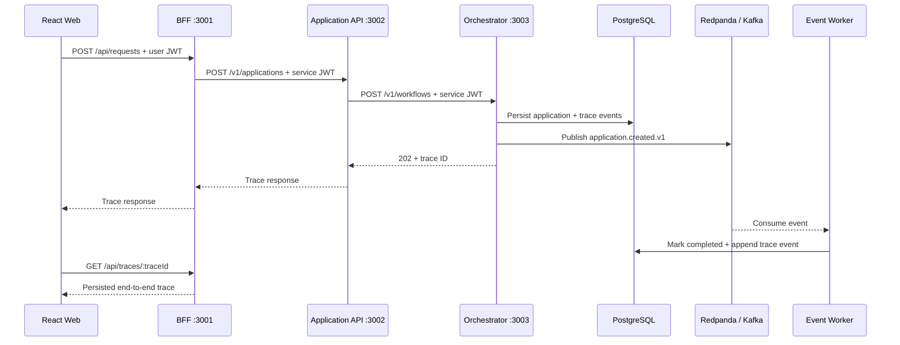

# Architecture and request lifecycle

The project separates the user-facing boundary, internal API, workflow coordination, and asynchronous processing into independently runnable TypeScript services.

## Authentication boundaries

- The React client obtains a short-lived demo **user JWT** for the BFF audience.
- The BFF validates the user JWT and issues a **service JWT** for the Application API.
- The Application API validates that audience and issues another service JWT for the orchestrator.
- Wrong token type, secret, or audience stops the request at the corresponding boundary.

The demo token issuer is intentionally local-only. A production version would use an external identity provider and managed secrets.

## Observability

Every request carries `x-trace-id`. Services emit structured logs and OpenTelemetry spans to Jaeger. Workflow and worker events are also persisted in PostgreSQL so the UI can poll a complete trace after asynchronous processing finishes.

## Failure injection

The API accepts named scenarios that intentionally stop the request at a specific boundary. These are deterministic development faults—not claims that an actual external system failed.
